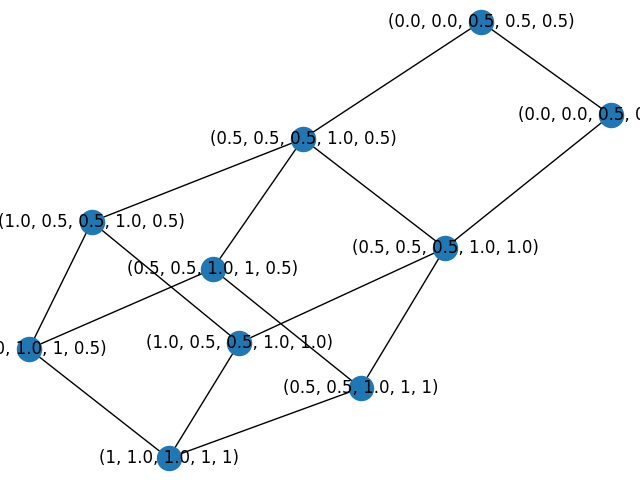

## Algorithms implemented by Matus Revicky
* **naive_concepts.py** - simple naive solution, based on formal concept definition, searches all possible values
works with fuzzy and finds all formal concepts

* **lattice.py** - based on article Computing the Lattice of All Fixpoints of a Fuzzy Closure Operator 
by Radim Belohlavek, works with fuzzy and finds all formal concepts and constructs lattice

* **object_intersection.py** - based on book Concept data analysis Theory and applications,p. 54 version does not work with 
fuzzy, finds all formal concepts

* **next_neighbours.py** - based on book Concept data analysis Theory and applications,p. 56 version does not work with 
fuzzy, finds all formal concepts and constructs lattice

* **find_factors.py** - based on article Factorization of matrices with grades, p.6,works with fuzzy and 
finds all factor concepts

* **rice_siff.py** - based on article http://www.dataznalosti.cz/historie/2008/download/articles/znalosti2008-Krajci.pdf,works with fuzzy and 
finds some factor concepts, but not all

Formal lattice from lattice algorithm - visualized


# Install

I highly recommend using pyCharm IDE
```
git clone https://gitlab.science.upjs.sk/matusrevicky/zna1.git
cd ZNA1
python -m venv venv
venv\Scripts\activate
```
```
(venv)$ pip install -r requirements.txt
``` 

* utils: basic method used across multiple algorithms
* data_files: sample data from articles
* test.py: each algorithm is tested on example from article

# How to use
* **main.py** - some of these algorithms are used on my dataset

* **naive_concepts.py**,**lattice.py**,**object_intersection.py**,**next_neighbours.py**,**find_factors.py**,**rice_siff.py** - all of these files have main, run using `python lattice.py` 
 
* **tests.py** - unit tested on examples from articles, takes cca. 2 minutes
